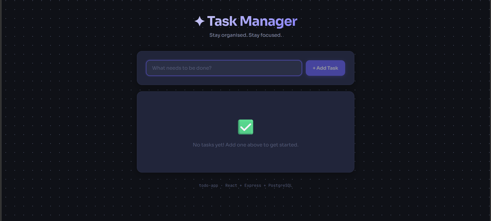
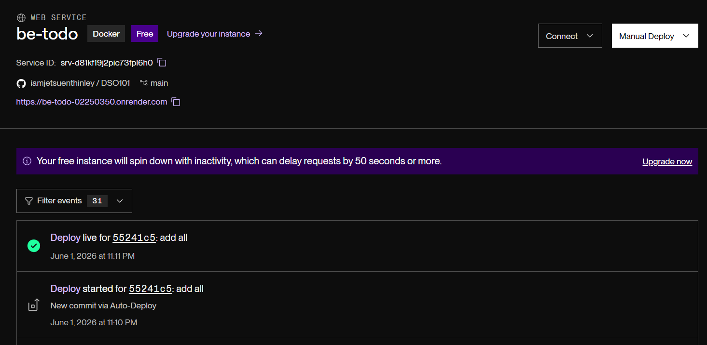
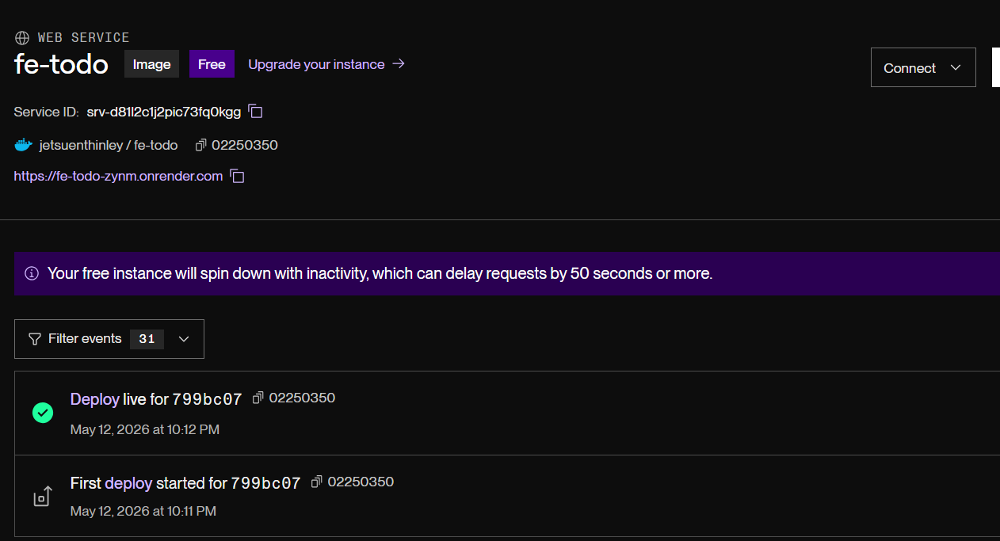
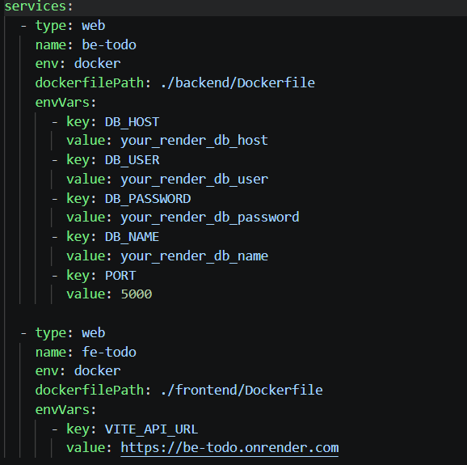

# DSO101 Assignment 1 - CI/CD Todo App

**Name:** Jetsuen Thinley 
**Student ID:** 02240350

---

## Step 0: Build the Todo App

Created a full-stack Todo app with a React frontend, Node.js backend, and PostgreSQL database. Environment variables were configured for database credentials and API URLs. The `.env` file was added to `.gitignore` so it is never committed to Git.

---

## Part A: Deploy Pre-built Docker Image

### 1. Build and Push to Docker Hub

Built Docker images for both the frontend and backend, then pushed them to Docker Hub using the student ID as the image tag.

### 2. Deploy on Render

Created two Web Services on Render using the Docker Hub images. Environment variables (database credentials, API URL, port) were added in the Render dashboard. A managed PostgreSQL database was also created on Render.

---

## Part B: Automated Build and Deploy

Added a `render.yaml` file to the root of the repository to configure both services. The GitHub repository was then connected to Render using the Blueprint feature. After this, every new commit pushed to GitHub automatically triggers a fresh build and deployment on Render.

## URLs:

https://fe-todo-zynm.onrender.com
https://be-todo-02250350.onrender.com