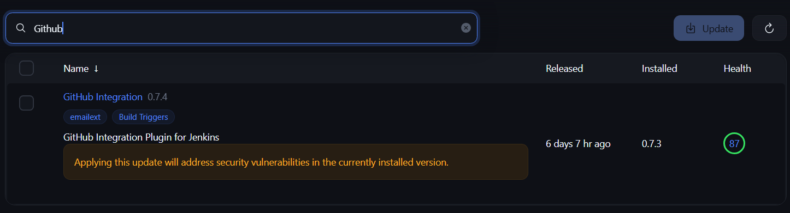
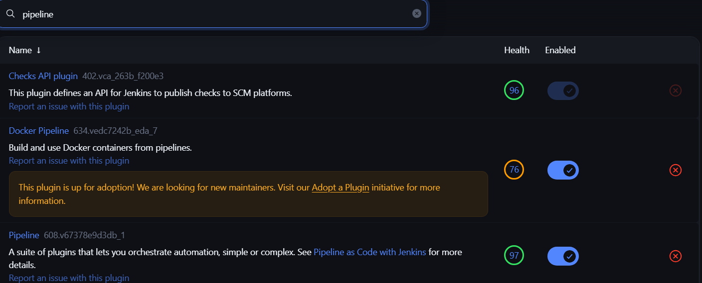
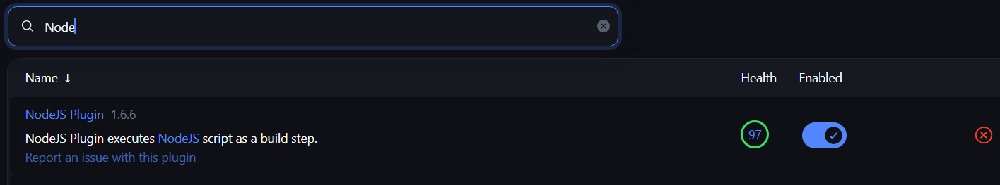
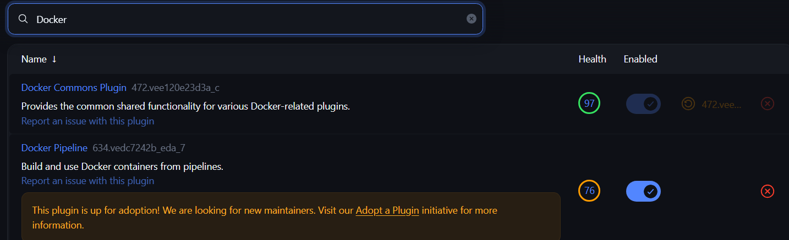
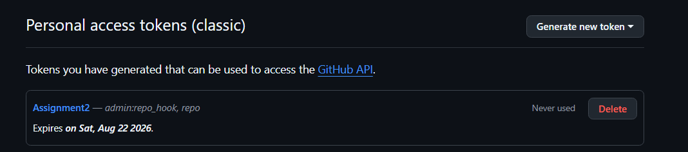
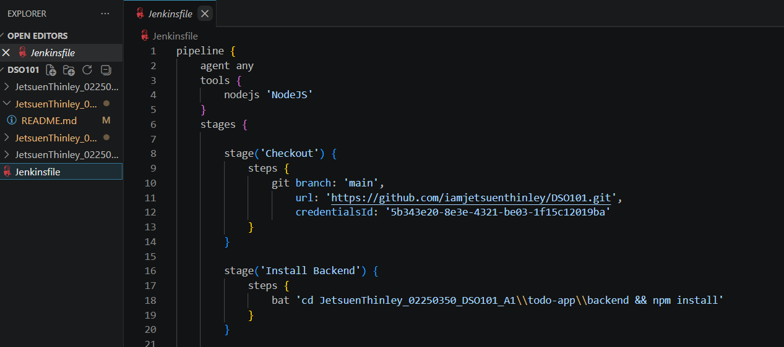

# DSO101 Assignment 2 - Jenkins CI/CD Pipeline

**Name:** Jetsuen Thinley
**Student ID:** 02250350

---

## Task 1: Jenkins Setup

Installed Jenkins from jenkins.io and accessed it on localhost:8080. Installed the following plugins from Manage Jenkins → Plugins → Available:
- NodeJS Plugin
- Pipeline
- GitHub Integration
- Docker Pipeline

Configured Node.js under Manage Jenkins → Tools → NodeJS and added LTS v20.x.

---

## Task 2: GitHub Repository Setup

The Todo app from Assignment 1 was already on GitHub. A Personal Access Token (PAT) was generated from GitHub → Settings → Developer Settings → Personal Access Tokens with `repo` and `admin:repo_hook` permissions.

The token was then added to Jenkins under Manage Jenkins → Credentials as Username & Password.

---

## Task 3: Jenkinsfile

A `Jenkinsfile` was created in the root of the repository with the following stages:
- **Checkout** — pulls code from GitHub
- **Install** — runs npm install
- **Build** — runs npm run build
- **Test** — runs npm test and publishes JUnit results
- **Deploy** — builds and pushes Docker image to Docker Hub

---

## Task 4: Running the Pipeline

---

## How the Pipeline Was Configured

The pipeline was configured using a Jenkinsfile stored in the GitHub repository. Jenkins was connected to GitHub using a Personal Access Token. Each push to the main branch triggers the pipeline automatically. The pipeline installs dependencies, builds the app, runs unit tests using Jest, and deploys the Docker image to Docker Hub.

---

## Challenges Faced

- **Jenkins service logon credentials error during installation** — During installation, Jenkins failed to start as a service due to a logon credentials error. Resolved by changing the service account to LocalSystem in the Jenkins installer options.

- **GitHub webhook not triggering the pipeline** — The pipeline did not trigger automatically on push. The issue was that Jenkins was running on localhost and was not accessible from GitHub's servers. Resolved by manually triggering builds during development and noting that a public URL (e.g., via ngrok) would be needed for webhook-based triggers in production.

- **npm test stage failing due to missing test script** — The pipeline failed at the Test stage because the `package.json` did not have a `test` script defined. Resolved by adding a Jest test script and a basic test file to satisfy the pipeline requirement.

- **Docker build failing due to missing Dockerfile** — The Deploy stage failed because there was no `Dockerfile` in the repository. Resolved by creating a minimal Dockerfile for the Node.js app.

- **Jenkins unable to find Node.js during the pipeline run** — The pipeline threw a `node: not found` error even though Node.js was configured in Global Tools. Resolved by ensuring the NodeJS tool name in the `Jenkinsfile` exactly matched the name set in Manage Jenkins → Tools → NodeJS.

- **Docker Hub push failing due to missing credentials** — The Docker push step failed with an authentication error. Resolved by adding Docker Hub credentials to Jenkins under Manage Jenkins → Credentials and referencing them correctly in the `Jenkinsfile` using `withCredentials`.

--- 

