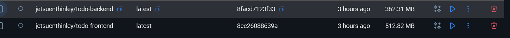
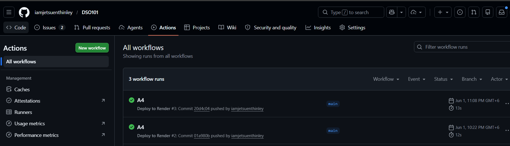
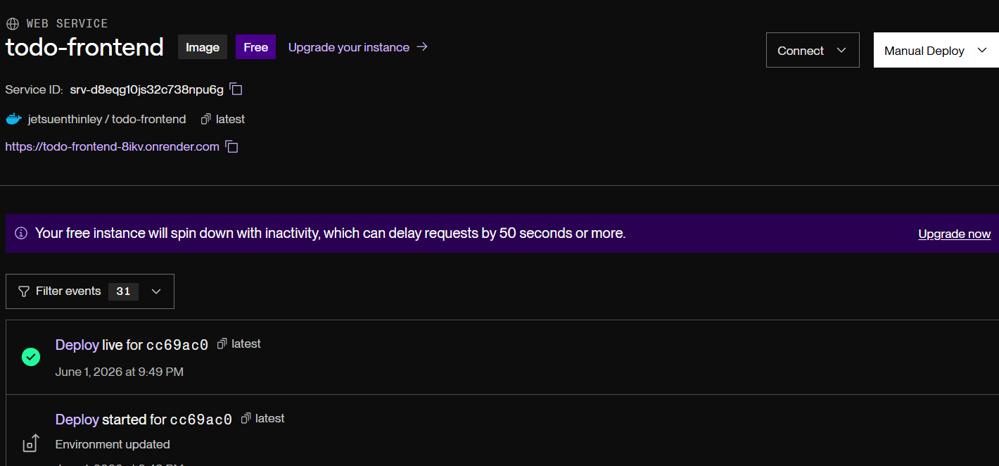

# DSO101 Assignment 3 - GitHub Actions CI/CD Pipeline

**Name:** Jetsuen Thinley
**Student ID:** 02250350 

---

## Task 1: GitHub Repository Setup

Verified that the GitHub repository was public and that the `package.json` file contained the necessary scripts for building and testing the application.

()

---

## Task 2: Docker Setup

Verified the Dockerfiles were present in the frontend and backend folders. The application was tested locally after containerizing to ensure everything worked before deploying.

---

## Task 3: GitHub Actions Workflow

Created a `.github/workflows/deploy.yml` file in the repository. The workflow was configured to trigger on every push to the main branch and includes the following steps:

- **Checkout** — pulls the latest code from the repository
- **Login to DockerHub** — authenticates using GitHub Secrets
- **Build and Push** — builds the Docker image and pushes it to DockerHub
- **Trigger Render Deployment** — calls the Render webhook to redeploy the latest image

GitHub Secrets were added for DockerHub credentials and the Render deployment webhook URL. No credentials were hardcoded in the code.

---

## Task 4: Render Deployment

Created a new Web Service on Render and selected "Deploy from existing image". Configured the service to use the DockerHub image. The Render webhook was copied and added as a GitHub Secret so the workflow can trigger redeployments automatically.

---

## Steps Taken

1. Verified GitHub repository was public with correct package.json scripts
2. Confirmed Dockerfiles were in place and tested locally
3. Created the GitHub Actions workflow file with all four steps
4. Added DockerHub and Render credentials as GitHub Secrets
5. Created the Render service using the existing Docker image
6. Copied the Render webhook URL and added it to GitHub Secrets
7. Pushed a commit to trigger the full pipeline and verified each step

---

## Challenges Faced

- **Locating the Render webhook URL** — It was not immediately obvious where to find it. After exploring the dashboard, it was found under the service's Settings tab under the "Deploy" section.
- **GitHub Secrets configuration** — Initially the secret names in the workflow YAML did not match the names set in GitHub, causing authentication failures. Fixed by ensuring the secret names were consistent across both.
- **DockerHub login failing in the workflow** — The workflow failed on the login step because the DockerHub token was accidentally copied with trailing whitespace. Re-entering the token carefully resolved the issue.
- **Render not picking up the new image** — After the workflow pushed the image to DockerHub, the Render service did not redeploy until the webhook trigger step was correctly configured with the full webhook URL.
- **Workflow not triggering on push** — The `on: push` trigger was scoped to a branch name that did not match the actual branch (`master` vs `main`), so the pipeline did not run. Correcting the branch name in the YAML fixed this.

---

## Learning Outcomes

- Learned how to set up a full CI/CD pipeline using GitHub Actions
- Understood how to securely manage credentials using GitHub Secrets
- Learned how to connect DockerHub and Render for automated deployments
- Understood how render webhooks work for triggering redeployments

---

## Live Deployment

https://fe-todo-02240353.onrender.com
https://be-todo-02240353.onrender.com

