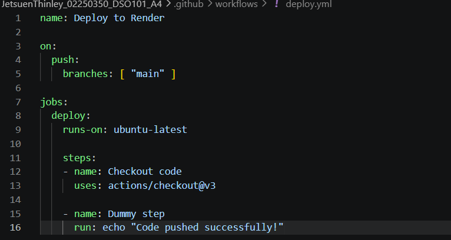
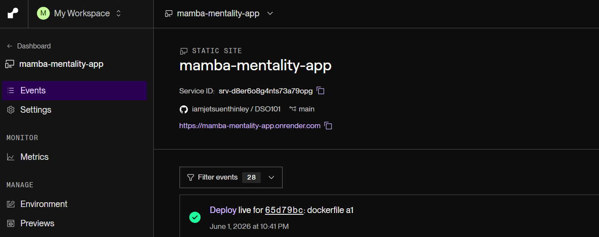

# My First CI/CD Deployment

I asked claude to make a simple dummy website and deployed using GitHub Actions and Render.

## What's in this project

* `index.html` — the main webpage
* `.github/workflows/deploy.yml` 

## How I built and deployed this

### 1\. Created the project locally

Built a static HTML/CSS site with a navbar, hero section, and feature cards.

### 2\. Pushed to GitHub

git init
git add .
git commit -m "first commit"
git branch -M main
git remote add origin <repo-url>
git push -u origin main

### 3\. Set up GitHub Actions

Added a workflow file at `.github/workflows/deploy.yml` that triggers on every push to `main`.

### 4\. Deployed on Render

* Signed in to [render.com](https://render.com) with GitHub
* Clicked **New > Static Site**
* Connected this repository
* Set publish directory to `.` (root)
* Clicked **Deploy**

## Live URL

[https://mamba-mentality-app.onrender.com]

## Tools used

* GitHub
* GitHub Actions
* Render

